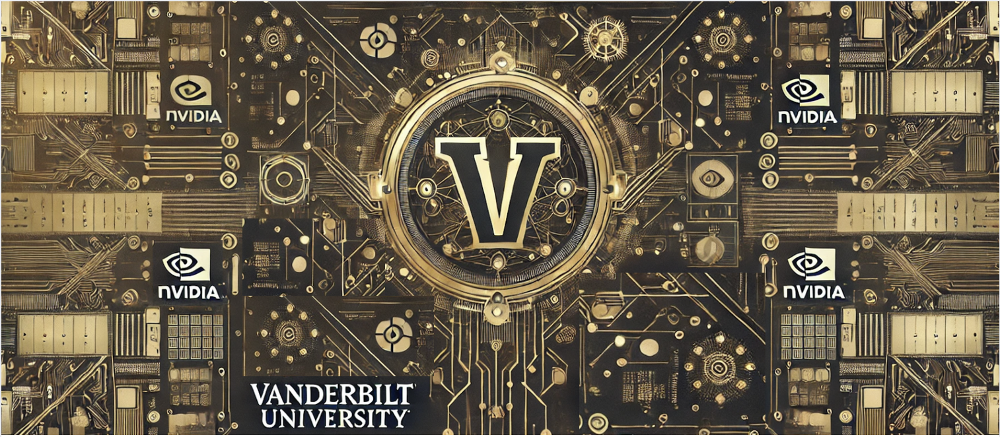

# NVIDIA Clinicians Assistant

## Background
Healthcare professionals often face the challenge of preparing for patient meetings with minimal time, sometimes as little as 10 minutes. This limited preparation time can make it difficult to review and understand a patient's medical history thoroughly. However, the advancement of large language models (LLMs) and generative language models offers a promising solution to this issue.

## Project Concept
This project is an AI-powered virtual "clinical assistant" that leverages a Retrieval-Augmented Generation (RAG) pipeline using LangChain, NVIDIA embeddings, and Milvus as the vector store. The clinical assistant can efficiently sift through extensive patient data, intelligently search for relevant information, and answer questions about diagnoses, health histories, and more. It allows users to upload a PDF document, process and store document embeddings in Milvus, and ask questions based on the content of the document. This application aims to streamline the preparation process for healthcare professionals by providing quick and accurate summaries of health records and answering specific queries about individual patients.

## Objectives
1. Answering Health-Related Questions: The virtual assistant should be able to respond to questions related to a patient's health and diagnosis.
   
2. Summarizing Health History: It should summarize the patient's health history, emphasizing recent reports while understanding medical terminology and temporal effects.

## Training Data

## Technologies Used

- **NVIDIA Embeddings**: Utilizes `nvidia/nv-embedqa-e5-v5` for embedding text.
- **Milvus Vector Store**: Uses Milvus to store document embeddings, enabling efficient retrieval for question answering.
- **Chat Model**: Uses `meta/llama-3.1-8b-instruct` to generate answers based on retrieved document content.

## Evaluating Performance


## Setup Steps

Follow these steps to get the chatbot up and running in less than 5 minutes:

### 1. Clone this repository 


### 2. Start NVIDIA Containers: 
Use the script_start.sh script to start the embedding and chat model containers

```bash
./script_start.sh true true true
```
First true initializes the Milvus database.
Second true starts the NVIDIA Embedding Model service.
Third true starts the NVIDIA Chat Model service.

### 3. Upload PDF Documents: 
Place the PDF documents you wish to process in the `./MIMIC_notes_PDF/ ` folder

### 4. Run the pipeline

```bash
python basic_RAG.py
```
