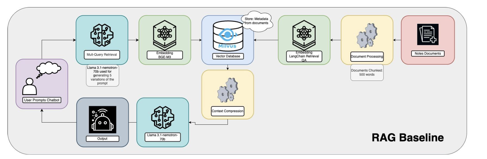

# NVIDIA Clinicians Assistant
By Margo Kim, Sankhya Sivakumar, Brandon Ma & Sarah Auch
## Background
Healthcare professionals often face the challenge of preparing for patient meetings with minimal time, sometimes as little as 10 minutes. This limited preparation time can make it difficult to review and understand a patient's medical history thoroughly. However, the advancement of large language models (LLMs) and generative language models offers a promising solution to this issue.

## Project Concept
This project is an AI-powered virtual "clinical assistant" that leverages a Retrieval-Augmented Generation (RAG) pipeline using LangChain, NVIDIA embeddings, and Milvus as the vector store. The clinical assistant can efficiently sift through extensive patient data, intelligently search for relevant information, and answer questions about diagnoses, health histories, and more. It allows users to upload a PDF document, process and store document embeddings in Milvus, and ask questions based on the content of the document. This application aims to streamline the preparation process for healthcare professionals by providing quick and accurate summaries of health records and answering specific queries about individual patients.

## Objectives
1. Answering Health-Related Questions: The virtual assistant should be able to respond to questions related to a patient's health and diagnosis.
   
2. Summarizing Health History: It should summarize the patient's health history, emphasizing recent reports while understanding medical terminology and temporal effects.

### MIMIC-IV-Note Dataset
[Visit the MIMIC-IV Clinical Database](https://physionet.org/content/mimic-iv-note/2.2/)

The MIMIC-IV-Note dataset is a collection of deidentified free-text clinical notes linked to the MIMIC-IV clinical database. It is designed to advance research in clinical natural language processing (NLP) by addressing the scarcity of large-scale, open-access clinical text datasets.

#### This dataset includes:
- **331,794 deidentified discharge summaries** from **145,915 patients** admitted to the hospital and emergency department.
- **2,321,355 deidentified radiology reports** for **237,427 patients**.

The data is sourced from the Beth Israel Deaconess Medical Center in Boston, MA, USA, and all notes have undergone deidentification under the Health Insurance Portability and Accountability Act (HIPAA) Safe Harbor provision.

## Technologies Used

- **NVIDIA Embeddings**: Utilizes `nvidia/nv-embedqa-e5-v5` for embedding text.
- **Milvus Vector Store**: Uses Milvus to store document embeddings, enabling efficient retrieval for question answering.
- **Chat Model**: Uses `meta/Llama 3.1 70b nemotron` to generate answers based on retrieved document content.


## Evaluation Using Ragas

### Overview
Ragas is an open-source library designed for evaluating Large Language Model (LLM) applications, specifically **Retrieval Augmented Generation (RAG)** pipelines. This project uses Ragas to assess the performance of our clinical assistant chatbot and iteratively improve its architecture.

### Evaluation Workflow
Ragas allows us to:
1. Generate a test set of queries.
2. Evaluate pipeline performance using the `evaluate_pipeline` function and a set of metrics.
3. Compare answers to test set queries against the ground truth.

#### Metrics Evaluated
The following metrics are used to assess the chatbot's performance:
- **Context Precision**: Measures whether the retrieved documents are relevant to the query.
- **Recall**: Measures whether all relevant documents are retrieved.
- **Response Relevance**: Measures the alignment between the generated response and the ground truth.

### Architectures for Evaluation
We have developed and named four architectures to measure performance and improve the chatbot's effectiveness:
1. **Basic RAG**: The simplest implementation of a RAG pipeline.
2. **Advanced Document Splitting RAG**: Incorporates optimized document chunking strategies.
3. **Hybrid Search RAG**: Combines vector search with traditional keyword-based search.
4. **Advanced Document Splitting and Hybrid Search RAG**: Integrates advanced document splitting with hybrid search for maximum performance.

### Knowledge Graph for Test Set Questions

### Architectures

**Basic RAG**

#### Key Features:

- Documents are chunked with a maximum of 500 words, using a 50-word overlap between chunks
- Metadata, such as the date of entry, is stored in the Milvus database

**Reasoning:**
This is the first version created based on a prototype provided to us by our NVIDIA partners. The base model adds metadata to enhance the relevance of the document chunks.

**Advanced Document Processing RAG**


#### Key Features:

- An LLM is used to extract subheadings from the documents
- Another call is made to extract content based on the subheadings, then chunk the extracted content into 500-word segments with a 50-word overlap. The chunked documents, along with their subheadings and metadata, are stored to the Milvus database.

**Reasoning:**
Strategically chunking the documents and storing the subheadings in the database provides the LLM with more contextually relevant information.

**Hybrid Search RAG**


#### Key Features:
- Documents are chunked with a maximum of 500 words, using a 50-word overlap between chunks
- Metadata, such as the date of entry, is stored in the Milvus database
- An additional layer is added to the basic RAG architecture, called Hybrid Search
- Hybrid Search uses both dense and sparse search techniques

**Reasoning:**
Sparse search ensures high precision by matching exact terms, which is critical for queries with specific keywords. Dense search improves recall by identifying semantically related documents, even when there’s no direct keyword overlap. The results from both searches are combined using a scoring mechanism, where the relevance scores from sparse and dense searches are weighted and aggregated.

**Advanced Document Processing & Hybid Search RAG**


#### Key Features:
- Combines document processing from the Advanced Document Processing RAG Architecture with Hybrid Search from the Hybrid Search RAG Architecture.

**Reasoning:**
This architecture provides the most contextual information possible to the LLM by leveraging Advanced Document Processing and Hybrid Search, which ensures both precise keyword matching and semantic understanding for improved retrieval accuracy.

## Setup Steps

Follow these steps to get the chatbot up and running in less than 5 minutes:

### 1. Clone this repository 


### 2. Start NVIDIA Containers: 
Use the script_start.sh script to start the embedding and chat model containers

```bash
./script_start.sh true true true
```
First true initializes the Milvus database.
Second true starts the NVIDIA Embedding Model service.
Third true starts the NVIDIA Chat Model service.


### 3. Run the pipeline

```bash
python basic_RAG.py
```

## Future Impact & Improvments

### What is the impact of Clinicians Assistant?

1.  Hospital data is increasingly becoming publicly available. This project demonstrates how de-identified hospital data can be used for good by enabling better insights, improving decision-making, and supporting patient care while maintaining privacy and compliance with regulations.
   
2.  This project showcases different variations of RAG Architecture designed to enhance performance. It aims to inspire others to build upon these architectures or adapt them for applications in other fields, fostering innovation and broadening their impact across diverse domains.

### What is the Next Step?

1. The notes documents are just one half of the puzzle, as information is also stored in tabular data, such as gender, age, and readings from medical devices that capture data every minute. The goal of this project is to generate responses that incorporate information from both the notes documents and the tabular data. This integration allows users to access the maximum amount of information at their fingertips.

2. We are also interested in adding another layer to the current architectures called ReRank, specifically `rerank-qa-mistral-4b`. This GPU-accelerated model is optimized to provide a probability score indicating whether a given passage contains the necessary information to answer a question effectively.


