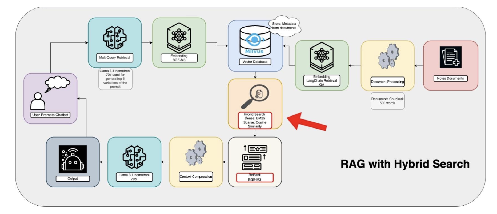

# NVIDIA Clinicians Assistant
By Margo Kim, Sankhya Sivakumar & Sarah Auch
## Background
Healthcare professionals often face the challenge of preparing for patient meetings with minimal time, sometimes as little as 10 minutes. This limited preparation time can make it difficult to review and understand a patient's medical history thoroughly. However, the advancement of large language models (LLMs) and generative language models offers a promising solution to this issue.

## Project Concept
This project is an AI-powered virtual "clinical assistant" that leverages a Retrieval-Augmented Generation (RAG) pipeline using LangChain, NVIDIA embeddings, and Milvus as the vector store. The clinical assistant can efficiently sift through extensive patient data, intelligently search for relevant information, and answer questions about diagnoses, health histories, and more. It allows users to upload a PDF document, process and store document embeddings in Milvus, and ask questions based on the content of the document. This application aims to streamline the preparation process for healthcare professionals by providing quick and accurate summaries of health records and answering specific queries about individual patients.

## Objectives
1. Answering Health-Related Questions: The virtual assistant should be able to respond to questions related to a patient's health and diagnosis.
   
2. Summarizing Health History: It should summarize the patient's health history, emphasizing recent reports while understanding medical terminology and temporal effects.

## Model and Dataset Card
### Models

- **Embeddings**: Utilizes BGE M3 for embedding text.
- **Milvus Vector Store**: Uses Milvus Lite to store document embeddings, enabling efficient retrieval for question answering.
- **Chat Model**: Uses `llama-3.1-nemotron-70b-instruct` to generate answers based on retrieved document content.

#### Primary Use Cases:
- Rapid patient history review
- Medical document Q&A
- Clinical history summarization

### Dataset
- **Source**: [Visit the MIMIC-IV Clinical Database](https://physionet.org/content/mimic-iv-note/2.2/)

The MIMIC-IV-Note dataset is a collection of deidentified free-text clinical notes linked to the MIMIC-IV clinical database. It is designed to advance research in clinical natural language processing (NLP) by addressing the scarcity of large-scale, open-access clinical text datasets.

#### This dataset includes:
- **331,794 deidentified discharge summaries** from **145,915 patients** admitted to the hospital and emergency department.
- **2,321,355 deidentified radiology reports** for **237,427 patients**.

The data is sourced from the Beth Israel Deaconess Medical Center in Boston, MA, USA, and all notes have undergone deidentification under the Health Insurance Portability and Accountability Act (HIPAA) Safe Harbor provision.

#### Access Requirements:
- PhysioNet credentials
- MIMIC-IV training completion
- Data use agreement
## Architectures

### Architectures for Evaluation
We have developed and named four architectures to measure performance and improve the chatbot's effectiveness:
1. **Basic RAG**: The simplest implementation of a RAG pipeline.
2. **Advanced Document Splitting RAG**: Incorporates optimized document chunking strategies.
3. **Hybrid Search RAG**: Combines vector search with traditional keyword-based search.
4. **Advanced Document Splitting and Hybrid Search RAG**: Integrates advanced document splitting with hybrid search for maximum performance.


**Basic RAG**

#### Key Features:

- Metadata-aware Retrieval: Document chunks are stored with metadata (e.g., patient ID, chart date/time) to prioritize temporally relevant content.
- Multi-query Expansion: For each query, five semantically varied versions are generated using the LLM and used independently for retrieval, increasing recall.
- Context Compression: Up to 50 retrieved chunks are deduplicated and reordered using LongContextReorder to maximize input quality for the LLM.
- Faithfulness Constraints: The LLM is explicitly instructed to cite evidence and distinguish between factual statements and inferences.

**Reasoning:**
This pipeline enhances the basic RAG structure by increasing robustness, temporal relevance, and citation faithfulness—critical in clinical settings where transparency and accuracy matter most

**Advanced Document Processing RAG**


#### Key Features:

- Subheading Extraction: The LLM identifies domain-specific subheadings (e.g., "Diagnosis", "Treatment Plan") from clinical notes.
- Section-aware Chunking: Content under each subheading is recursively split into smaller, coherent chunks while maintaining clinical context.
- Context-aware Retrieval: Subheading and timestamp metadata are stored and used during retrieval to focus on the most contextually relevant information.

**Reasoning:**
By preserving the document's logical structure and aligning retrieval with clinical semantics, this design significantly improves contextual relevance and precision for specialized queries

**Hybrid Search RAG**


#### Key Features:
- Hybrid Retrieval: Combines dense (semantic) search with sparse (keyword-based) search to capture both semantic relevance and exact term matches.
Reranking: Retrieved results are rescored and reordered using a BGE-M3-based reranker.
Context Compression: After retrieval, redundant content is filtered and reordered to maximize informativeness before passing to the LLM.

**Reasoning:**
This architecture improves recall, especially for vague or underspecified queries. However, increased breadth must be carefully compressed to avoid diluting answer quality

**Advanced Document Processing & Hybid Search RAG**


#### Key Features:
- Combines document processing from the Advanced Document Processing RAG Architecture with Hybrid Search from the Hybrid Search RAG Architecture.

**Reasoning:**
This architecture provides the most contextual information possible to the LLM by leveraging Advanced Document Processing and Hybrid Search, which ensures both precise keyword matching and semantic understanding for improved retrieval accuracy.

## Evaluation Using Ragas

### Overview
Ragas is an open-source library designed for evaluating Large Language Model (LLM) applications, specifically **Retrieval Augmented Generation (RAG)** pipelines. This project uses Ragas to assess the performance of our clinical assistant chatbot and iteratively improve its architecture.

### Knowledge Graph for Test Set Questions


First, we extract and store four critical pieces of information:
- The raw content along with its embeddings
- Key entities using our specialized entity extractor
- Important topics that capture the document's themes
- And a summary with its corresponding embedding


**How it works?**
The entity_jaccard_similarity edge indicates how similar the two nodes are based on their shared entities, using the Jaccard similarity coefficient.


- The sampling pool feature, which helps us maintain context accuracy
- The persona system, which lets us tailor responses based on user expertise level

#### What Are Multi-hop Queries?

Think of multi-hop queries as connecting the dots between different pieces of information across multiple documents. Instead of just getting an answer from a single source, we're building relationships between documents to create more sophisticated and nuanced queries.

**The Process**

Step 1: Document Loading

Step 2: Creating the Knowledge Graph

- We create a base knowledge graph where each document becomes a node.
  
Step 3: Setting Up Our Tools

- An LLM (Large Language Model)
  
- An embedding model

Step 4: Extractors and Relationship Builders

We use four key tools:

- A headline extractor to pull out important headers
- A headline splitter to break documents into manageable chunks
- A keyphrase extractor to identify important concepts
- An Entitiy extractor to identify important entities mentioned in the document
- An overlap score builder to create connections between documents

Step 5: Configuring Personas

To make our queries more realistic and targeted, we create personas.

In our case, we have three different personas.

- Clinical Care Coordinator
- Medical Researcher
- Healthcare Provider

Step 6: Query Generation

- Finding qualified pairs of nodes based on their relationships
- Matching keyphrases with our personas
- Creating combinations of nodes, personas, and query styles
- Sampling to get our final queries


**Key Findings**

A visualization appears to show a medical document network where:

1. Medical documents (green nodes) are densely clustered in the center and highly interconnected

2. Metadata elements - both entities (blue) and themes (yellow) - are evenly distributed on the sides

3. Documents show consistent connectivity levels and form natural groupings around related medical topics

The overall structure suggests a well-organized, richly cross-referenced collection of medical documents

### Evaluation Workflow
Ragas allows us to:
1. Generate a test set of queries.
2. Evaluate pipeline performance using the `evaluate_pipeline` function and a set of metrics.
3. Compare answers to test set queries against the ground truth.

#### Metrics Evaluated
The following metrics are used to assess the chatbot's performance:
- **Faithfulness**: Measures whether the model’s generated answers are factually supported by the retrieved source content. This metric helps detect hallucinations or unsupported claims, which are especially dangerous in medical settings.
- **Answer Relevance**: Evaluates how well the answer aligns with the intent and content of the original clinical question. It penalizes incomplete or irrelevant responses, focusing on the user's query rather than strict factual correctness.
- **Context Precision**: Assesses the proportion of retrieved content that was actually useful for answering the question. High scores indicate that the retriever efficiently pulled in focused, relevant context rather than excessive or unrelated information.


### Evaluation Results

- RAG Baseline delivered the highest context precision (0.88) and answer relevance (0.69), suggesting that its simpler retrieval strategy, enhanced by multi-query expansion and context reordering, may help reduce noise and confusion for the LLM.
- Advanced Document Processing achieved the highest faithfulness (0.61) due to its structured chunking and metadata-aware retrieval, which provided semantically grounded inputs aligned with clinical intent.
- Hybrid Search maintained high relevance (0.68) and strong context precision (0.80) by combining dense and sparse retrieval methods, though faithfulness was slightly lower, likely due to surfacing loosely related fragments.
- Advanced Document Processing + Hybrid (the most complex pipeline) did not outperform simpler versions in answer relevance (0.59), possibly due to increased context noise, redundancy, or over-retrieval.

These results highlight a key insight: more complex architectures don’t guarantee better answers. The best performance stems from carefully balancing precision, relevance, and trustworthiness, rather than simply stacking more retrieval layers.


## Setup Steps

Follow these steps to get the chatbot up and running in less than 5 minutes:

### 1. Clone this repository 


### 2. Start Services: 
We ran the NVIDIA Llama 3.1 model via a Singularity container on a local GPU server.

- Ensure the Singularity container for the chat model is built and available on your server.
- Start the container manually on your GPU node to serve the LLM endpoint.

### 3. Run the Backend Pipeline
Use the following command to launch the RAG-based chatbot pipeline:
```bash
python backend/RAG_implementation.py
```


## Future Impact & Improvements

### What is the impact of Clinicians Assistant?

1. Improved Clinical Decision Support: As hospitals increasingly make medical data publicly accessible, this project showcases how an AI-powered assistant can distill complex clinical records into actionable insights—helping clinicians make faster, more confident decisions.
2. Architectural Innovation: By comparing four different RAG pipeline variants, this project establishes a reproducible framework for optimizing retrieval techniques. These approaches can inspire broader applications across fields where contextualized document search is critical.
3. Patient-Centric AI Design: The assistant supports—not replaces—clinicians by surfacing traceable, evidence-based summaries, ultimately aiming to improve patient care continuity, especially in time-constrained environments.

### What is the Next Step?

1. Scale Across Patients: Current evaluations use one patient. Future work will expand to multi-patient data to improve generalizability and simulate real-world diversity.
2. Add Tabular Data Support: Notes are only half the story. Incorporating vitals, labs, and structured EHR data will allow the assistant to provide more holistic answers.
3. Enable Patient-Level Isolation: Deployment will require designing retrieval systems that isolate document search by patient ID, ensuring safe and context-specific responses during inference.

## Sources:

 - “Context Precision.” Ragas, 1 Nov. 2024, docs.ragas.io/en/latest/concepts/metrics/available_metrics/context_precision/. 
 - “The High-Performance Vector Database Built for Scale.” Milvus, Milvus, 2024, milvus.io/.
 - “Introduction.” Ragas, 1 Nov. 2024, docs.ragas.io/en/stable/.
 - Johnson, Alistair, et al. “MIMIC-IV-Note: Deidentified Free-Text Clinical Notes.” PhysioNet, National Institute of Biomedical Imaging and Bioengineering, 6 Jan. 2023,    physionet.org/content/mimic-iv-note/2.2/. 
 - “Nvidia/Llama-3.1-Nemotron-70b-Instruct.” NVIDIA, NVIDIA Corporation, 2024, build.nvidia.com/nvidia/llama-3_1-nemotron-70b-instruct. 
 - “Response Relevancy.” Ragas, 1 Nov. 2024, docs.ragas.io/en/latest/concepts/metrics/available_metrics/answer_relevance/#.
 - Custom Multi-hop Query - Ragas. (n.d.). https://docs.ragas.io/en/stable/howtos/customizations/testgenerator/_testgen-customisation/


### Permissions Needed: 

A guide to gaining access to the MIMIC data used in this project is available here:  [Link](https://mimic.mit.edu/docs/gettingstarted/)


